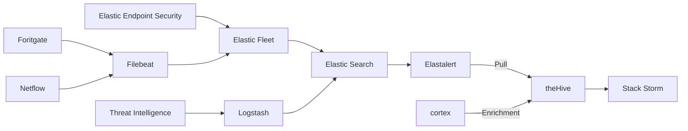

Recently I have been revamping my home security setup.
In this Blog I will try and reflect on what all used to build it and how I am planning to improve.

# Architecture



# Setup

## Elasticsearch

## theHive

## Elastalert

For the integration between Elasticsearch and theHive I used Elastalert2,
this is subject to change however in case I get annoyed enough.
My setup of Elastalert2 (not to be confused with the original elastalert) is a very simple docker container with config
and rules.


````yaml
version: '3.8'
services:
  elastalert2:
    container_name: elastalert
    restart: unless-stopped
    volumes:
      - './vol/elastalert/elastalert.yaml:/opt/elastalert/config.yaml'
      - './vol/elastalert/rules:/opt/elastalert/rules'
    image: jertel/elastalert2
````
{: file='docker-compose.yml'}


````yaml
rules_folder: /opt/elastalert/rules
run_every:
  seconds: 10
buffer_time:
  minutes: 15
es_host: elastic.host.name
es_port: 443
use_ssl: true
es_username: XXXX
es_password: XXXX
writeback_index: elastalert-status
alert_time_limit:
  days: 2
````
{: file='elastalert.yaml'}


````yaml
name: "Elasticsearch User"
type: "any"
index: ".siem-signals-default"
is_enabled: true
#realert:
#  minutes: 5
aggregation:
    minutes: 10
terms_size: 50
query_key: 'user.name'
aggregation_key: 'user.name'
aggregation_by_match_time: true

timestamp_field: "@timestamp"
timestamp_type: "iso"

filter:
- term:
    signal.status: "open"
- query:
    wildcard:
      user.name: "*"

alert: hivealerter
hive_connection:
  hive_host: http://thehive
  hive_port: 9000
  hive_apikey: XXXXXXXXXXX
hive_alert_config:
  type: 'external'
  source: 'elastalert'
  severity: 2
  tags: [signal.rule.name, agent.name, user.name]
  tlp: 3
  status: 'New'
  follow: True
  description_args: [rule.name]
  description: '{0}'
hive_observable_data_mapping:
    - ip: source.ip
    - ip: destination.ip
    - ip: host.ip
    - domain: source.domain
    - domain: destination.domain
    - domain: host.name
    - domain: dns.question.name
    - hash: hash.md5
    - hash: hash.sha1
    - hash: hash.sha256
````
{: file='rules/rule.yaml'}
